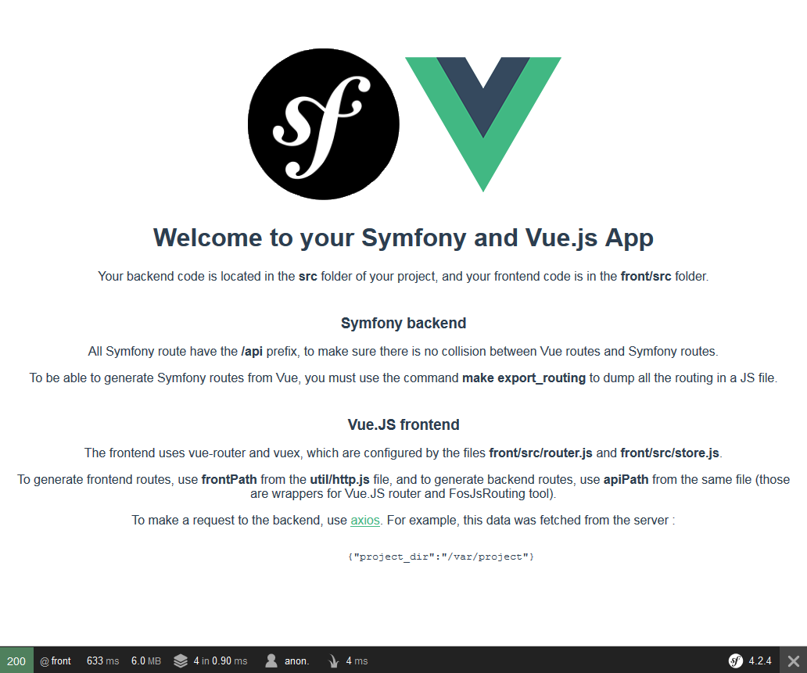

# Symfony & Vue.JS skeleton 

This project demonstrate how Symfony 4 and Vue.JS 2 can be integrated in the same project.

## Why does this exist ?

Most template / tutorials online help you build a website with a separated frontend and backend, but few will explain how you can host both in the same project, although it is useful for small project which have only one developer (or at least no separated frontend/backend teams).

## Dependencies

This project suppose you use Virtualbox and Vagrant. Although if you don't want to you can delete the `Vagrantfile` and `ansible` directory and serve the app in development however you want (for example using Symfony's dev server).

## Installation
### On your system
Customize variables inside `ansible/vars.yml` according to your needs.

Add whatever you chose for the `server_domain` var to your host file (on Windows it is located in `C:\Windows\System32\drivers\etc\hosts`).

Start the virtual machine by running `vagrant up` inside you project folder.

### On the VM

The frontend is compiled once by Ansible when the WM is created, but to watch changes made to the files you can use `make watch_assets`, or run `make vue_ui` and manage webpack through vue-ui on port 8001 (*http://project.dom:8001* in this example)

## Usage

Once the installation is complete, you should see this page when going on the domain you chose on port 8000 (*http://project.dom:8000* in this example) :

You can then start developing your frontend at `front/src/` and your backend at `src/`.